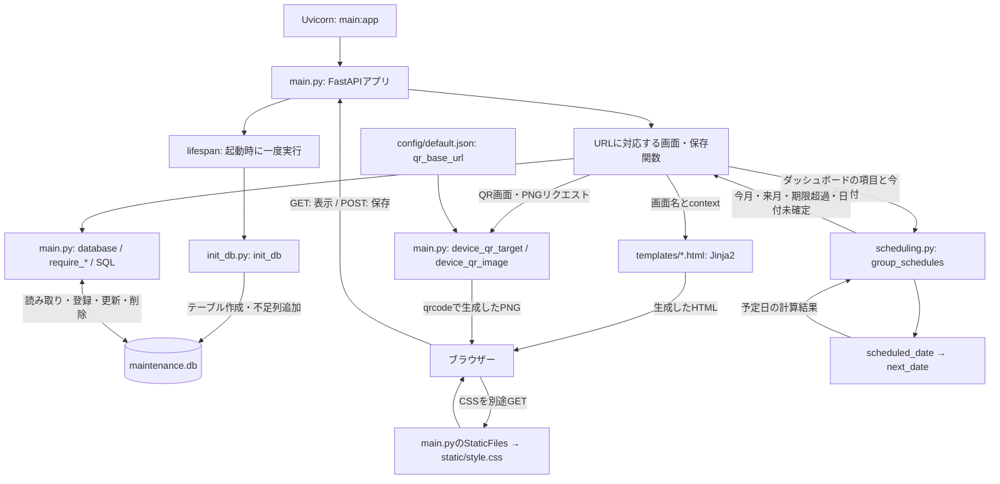
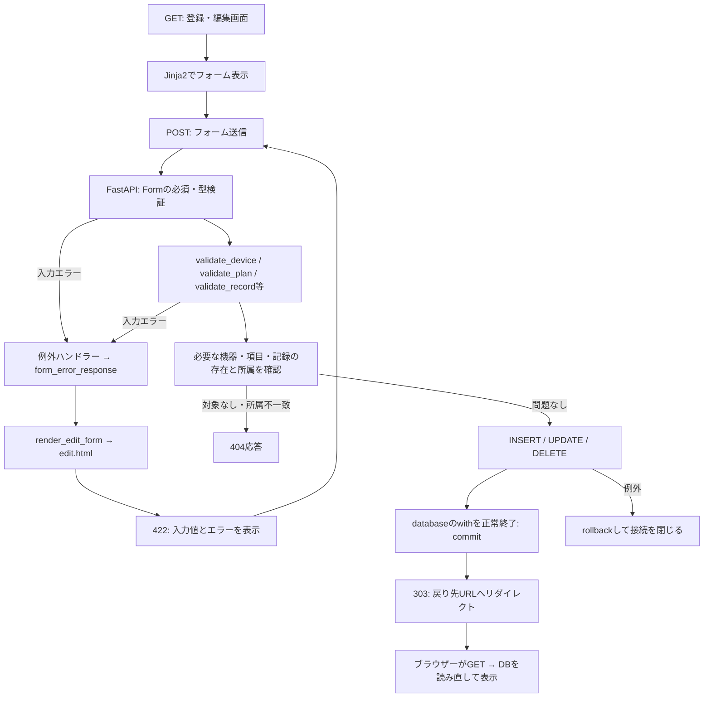
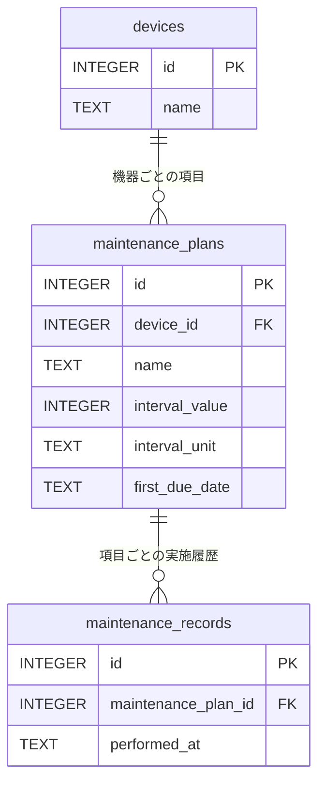

# maintenance-recorder

家にある生活用品・家電製品などの機器、メンテナンス項目、実施記録を管理するWebアプリです。
実施履歴から次回予定日を計算し、ダッシュボードに表示します。現在の実装には、メールなどへの自動通知やバックグラウンドの定期実行はありません。

## 起動方法

FastAPI、Uvicorn、Jinja2、python-multipart、qrcode（Pillowを含む）が必要です。
`pyproject.toml` に記載されている依存関係は現在QR関連のみなので、初めて環境を作る際は以下を実行してください。
リポジトリ直下から、使用するPython環境で起動します。

```sh
python -m pip install fastapi uvicorn jinja2 python-multipart "qrcode[pil]>=8.2,<9"
python -m uvicorn main:app --app-dir src/maintenance-recorder-package --host 127.0.0.1 --port 8000
```

ブラウザーで `http://127.0.0.1:8000` を開きます。`main:app` は「main.pyにあるappを読み込む」という指定です。
DBは起動時に初期化・更新されます。以下の図は2026年9月のリファクタリング後の実装に対応します。

## 全体プロセスとスクリプトの関係



PythonがHTMLを生成してブラウザーへ返す構成です。テンプレートが直接SQLを実行するわけではありません。
起動時のDB準備が終わるとリクエストを受け付け、以後はURLとHTTPメソッドに応じて `@app.get` / `@app.post` の関数が呼ばれます。

| ファイル・場所 | 役割と呼び出し関係 |
| --- | --- |
| `src/maintenance-recorder-package/main.py` | 入口。URLの振り分け、入力検証、SQL、HTML応答、QR生成を担当 |
| `src/maintenance-recorder-package/init_db.py` | `main.lifespan()` から呼ぶDB準備。単独実行も可能 |
| `src/maintenance-recorder-package/scheduling.py` | `main.home()` から呼ぶ予定計算。DB接続や画面表示は行わない |
| `src/maintenance-recorder-package/templates/` | mainから渡された値をHTMLに埋め込む |
| `src/maintenance-recorder-package/static/style.css` | 各画面に共通の見た目。`base.html` から読み込む |
| `src/maintenance-recorder-package/config/default.json` | QRの接続先をリクエストごとに読む。`production.json` への自動切替は未実装 |
| `src/maintenance-recorder-package/maintenance.db` | 機器・項目・実施記録のSQLite DB |
| `tests/test_refactoring.py` | 予定計算と、一時DB・ローカルHTTPサーバーによる回帰テスト |

### フォーム送信から保存まで



`database()` は `with` の終了時に変更を確定し、途中の例外では取り消し、最後に接続を閉じます。
`require_device` / `require_plan` / `require_record` は対象を取得し、見つからなければ404で処理を終えます。
項目の更新では `UPDATE ... WHERE id = ? AND device_id = ?` の更新件数で同じ確認を行います。
削除確認画面のGETでは削除せず、確認後のPOSTで初めて削除します。

### ダッシュボードの予定が決まるまで

1. `main.home()` が `today()` で日本時間の今日を取得します。
2. SQLで稼働中・非該当以外の機器の項目を取得し、各項目の記録から `MAX(performed_at)` で最新実施日を求めます。
3. `scheduling.group_schedules()` が各項目について `scheduled_date()` を呼びます。
4. 実施済みなら `next_date()` で最新実施日＋周期を計算し、未実施なら初回予定日を使います。
5. 今日・来月1日・再来月1日を境に分類し、日付と項目IDで並べて `main.home()` に返します。
6. `index.html` に分類結果と直近20件の履歴を渡して表示します。

次回予定日をDBに書き込む処理はなく、ダッシュボードを開くたびに計算します。そのため記録の追加・修正・削除が次の表示に反映されます。

### データのつながり



図には関係と予定計算に必要な主な列を載せています。1台の機器に複数の項目、1項目に複数の実施記録が付きます。
名前ではなくIDでひも付くため、項目名を編集しても履歴の関連は維持されます。

### 画面とテンプレートの読み方

| 操作 | main.pyの主な関数 | テンプレート |
| --- | --- | --- |
| ダッシュボード | `home` | `index.html` |
| 機器一覧・詳細 | `device_list` / `device_detail` | `device_list.html` / `device_detail.html` |
| 機器登録 | `device_new` → POSTで `create_device` | `device_new.html` |
| 項目追加 | `maintenance_plan_new` → POSTで `create_maintenance_plan` | `maintenance_plan_new.html` |
| 実施記録追加 | `maintenance_record_new` → POSTで `create_maintenance_record` | `maintenance_record_new.html` |
| 各種編集 | `device_edit` / `plan_edit` / `record_edit` → 各 `update_*` | `edit.html` |
| 記録削除 | `record_delete_confirmation` → `delete_maintenance_record` | `record_delete.html` |
| QR表示・保存 | `device_qr` / `device_qr_image` | `device_qr.html` / PNG応答 |

全画面は `base.html` を `extends` で継承し、タイトルと本文を差し替えます。
登録・編集の入力欄は `_fields.html` のマクロ（再利用するHTML部品）、機器詳細とQR画面のタブは `_device_tabs.html` の `include` を使います。
入力欄の `name` とPythonの `Form` 引数が対応し、テンプレートへの `context` が表示に使う値になります。

コードを追うときは、まず対象URLの `@app.get` / `@app.post` を探し、そこから `validate_*`、`require_*`、SQL、`TemplateResponse` または `RedirectResponse` の順に読むと流れを把握できます。

## 機器・メンテナンスの編集

- 上部の「ダッシュボード」「機器一覧」で各画面に移動できます。
- 機器詳細の「機器情報を編集」「項目を編集」から専用画面へ移動します。通常のフォーム送信で保存し、入力エラー時は入力を保持して画面を再表示します。JavaScriptは使用しません。
- 機器には備考・稼働状態・定期メンテナンス区分（対象／非該当／未設定）を登録できます。
- 項目名を変更しても項目IDと実施記録の紐づけは維持します。名称の変更履歴は保存しません。
- 実施履歴を開くと、各記録の修正・削除ができます。
- 起動時に不足するDB列を追加します。既存の機器・項目・実施記録は維持します。手動での更新は `src/maintenance-recorder-package/init_db.py` を実行してください。

実施記録の削除には確認があります。削除した記録の復元機能はありません。

## ダッシュボードの予定
- 各メンテナンス項目の次回予定を、日本時間の今日に基づき「今月」「来月」「期限超過」に分類します。予定の項目名・実施記録ボタンから記録画面へ移動できます。
- 未実施の項目は、項目の登録・編集画面で「初回予定日」を設定してください。実施済みなら、最新の実施日＋周期で計算します。月・年は暦で加算し、存在しない日は月末に合わせます。
- 実施済みの予定は消え、次回予定に置き換わります。短い周期では、次回も今月の一覧に載る場合があります。未実施の期限超過は自動で先送りしません。
- 稼働中かつ非該当以外の機器が対象です。「未設定」でも項目が登録されていれば対象に含めます。
- 初回予定日がない項目や距離・使用時間・回数の周期は、日付を計算できない項目として別表示します。
- 実施履歴は実施日が新しい順（同日の場合は記録ID順）で20件まで表示します。記録の修正・削除も予定に反映します。
- 旧サンプル用の maintenance テーブルは参照しません。

機器登録時のメンテナンス項目の動的追加は未実装です。機器詳細から項目を追加してください。

テストは `python -m unittest discover -s tests -v` で実行します。一時DBとローカルのテスト用HTTPサーバーを使い、実データには書き込みません。

## 機器のQRコード

- QR生成用の依存ライブラリは `python -m pip install "qrcode[pil]>=8.2,<9"` で追加できます。
- 機器詳細の「QR出力」タブで、その機器の詳細URLを表示・PNG保存できます。QRはサーバー内で生成し、外部のQR生成サービスは使いません。
- 読み取り先のサーバーURLは `src/maintenance-recorder-package/config/default.json` の `qr_base_url` で指定します。現在は `http://192.168.3.167:8000` です。画面をlocalhostや8001番で開いても、表示URLとQR画像の読み取り先は指定したサーバーの `/devices/機器ID` になります。
- `qr_base_url` を空文字にすると、アクセス中のホスト名・ポートを使います。設定はリクエストごとに読み込みます。機器名を変更しても、同じ機器IDならリンク先は変わりません。
- スマートフォンは読み取り先のサーバーへ接続できるネットワークに接続してください。localhostや127.0.0.1は読み取った端末自身を指します。
- LAN接続ではサーバーの待受アドレス（例：uvicornの `--host 0.0.0.0`）とファイアウォールの許可が必要です。接続先のサーバーが稼働している必要があり、IPアドレス・ポート・公開URLが変わった場合はQRも作り直してください。

## ブランチ方針
2026/09/30までは main に開発途中のコミットが含まれていたため、このコミット以降は以下の運用に統一する。ID:"84b615ac2a5db065ae81ae3c40cfef4dda639f2a" まで<br>

- dev: 通常開発用ブランチ
- main: リリース済み・安定版のみ

リリース時は dev を main に --no-ff でマージ<br>
緊急修正は main に反映後、dev にも取り込む<br>